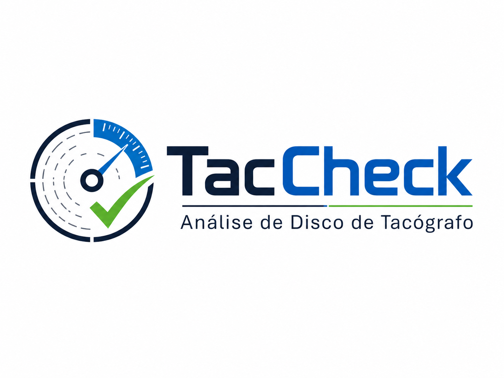

<p align="center">
  
</p>

# TacCheck

Aplicativo web estático para conferência de disco de tacógrafo por escala 40/60 e comparação objetiva com o relatório de ensaio.

## Rodar localmente

```bash
npm test
npm start
```

Depois abra:

```text
http://127.0.0.1:8765/index.html
```

Demo com o caso real `52,101 / 47,740`:

```text
http://127.0.0.1:8765/index.html?demo=1
```

## Estrutura

- `src/core/geometry.js`: retas, projecao 2D, eixo 40 -> 60, conversao tela/imagem.
- `src/core/tolerance.js`: tolerancia, divergencia, limites e aprovado/reprovado.
- `src/core/analysis.js`: orquestracao do calculo completo.
- `src/ui/viewer.js`: canvas com zoom, pan e conversao de coordenadas.
- `src/ui/app.js`: interface e geracao da evidencia marcada.
- `tests/`: testes automatizados dos casos reais, geometria e coordenadas.
- `evidencias/`: prints gerados para a entrega.
- `docs/`: regras, historico de solicitacoes, decisoes tecnicas e processo de versionamento.

## Documentacao

- `docs/REGRAS_DO_PROJETO.md`
- `docs/HISTORICO_DE_SOLICITACOES.md`
- `docs/PROCESSO_DE_VERSIONAMENTO.md`
- `docs/DECISOES_TECNICAS.md`
- `docs/TEMPLATE_SOLICITACAO.md`

## Metodologia

A análise compara a velocidade frequente estimada no disco com a velocidade registrada no relatório. Os limites são dinâmicos (`relatório ±4,000 km/h`), e somente diferença estritamente superior a 4 km/h gera alerta de possível reprovação. A linha de 50 km/h é apenas referência visual. Picos e quedas ficam em análise avançada opcional e não bloqueiam o cálculo principal.

## Provas geradas

- `evidencias/tela_demo_52_101_47_740.png`
- `evidencias/imagem_marcada_demo_52_101_47_740.png`

## Direitos autorais

© 2026 Leal DevWorks. Todos os direitos reservados.

TacCheck é uma ferramenta desenvolvida pela Leal DevWorks para análise técnica de discos de tacógrafo.

Rodapé padrão para relatórios futuros:

Gerado pelo TacCheck — © 2026 Leal DevWorks. Todos os direitos reservados.
